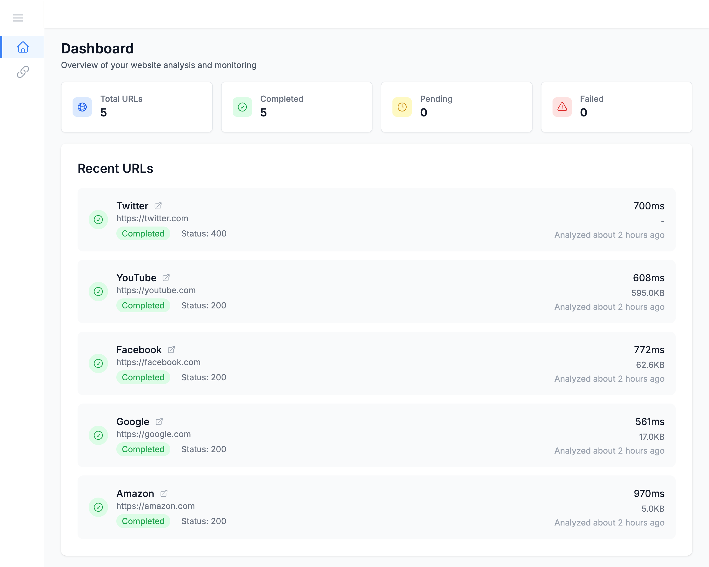
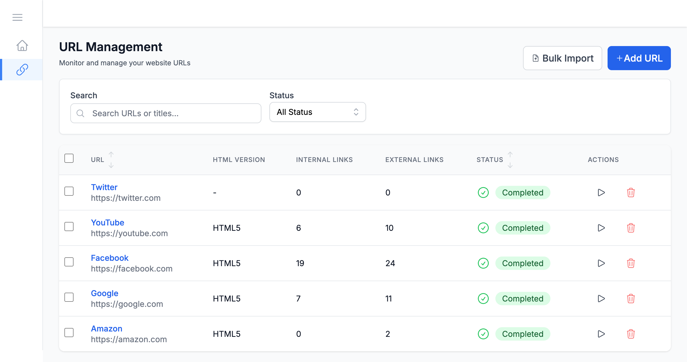
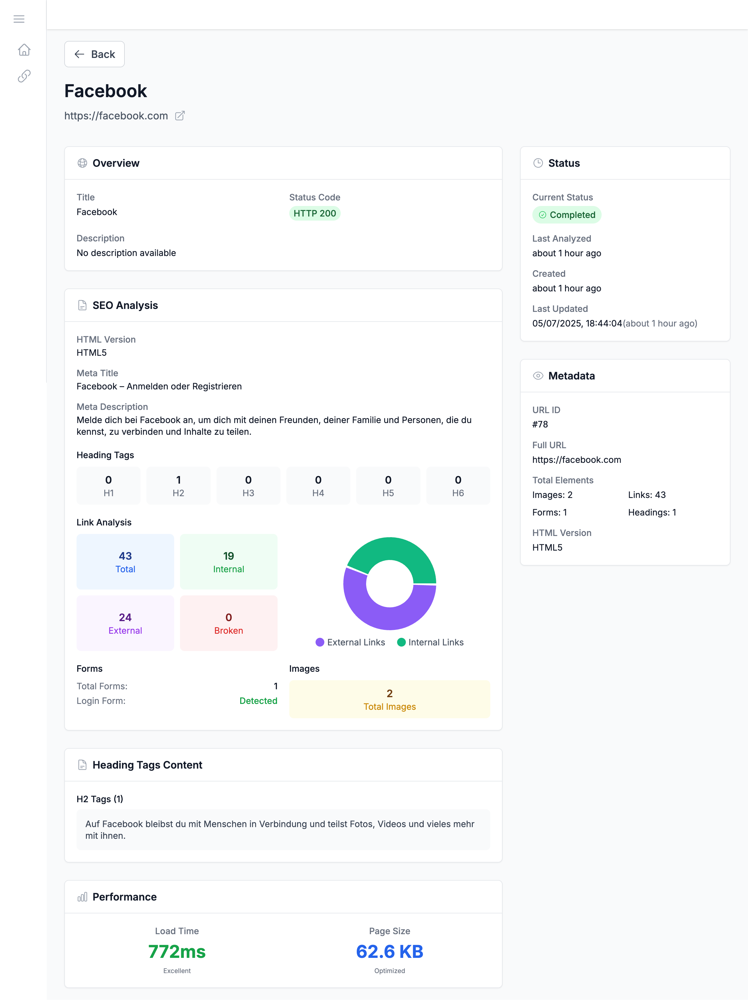

# 🌐 Website Analyzer Dashboard

A full-stack web application for analyzing websites with technical, SEO, and performance insights. The system crawls websites, extracts key metrics such as HTML version, heading structure, link health, and login form presence, and displays the results in a modern, responsive dashboard.

Built with a **React + TypeScript** frontend and a **Golang** backend, designed with scalability, clean architecture, and industry standards in mind.

## Images





---

## 🏗️ Architecture

This project follows a **monorepo** structure containing:

- **Frontend**: React + TypeScript with Vite, Tailwind CSS, React Query, and modern tooling.
- **Backend**: Go with Gin framework, GORM for ORM, and MySQL database.

---

## 📁 Project Structure

```
website-analyzer-dashboard/
├── frontend/                  # React TypeScript frontend
│   ├── src/
│   │   ├── components/        # Reusable UI components (buttons, forms, etc.)
│   │   ├── features/          # Feature-specific modules (URL Management, etc.)
│   │   ├── hooks/             # Global custom hooks
│   │   ├── layouts/           # Layout components (Sidebar, Page Layout)
│   │   ├── pages/             # Top-level pages/routes
│   │   ├── services/          # API service layer (Fetch/Axios)
│   │   ├── utils/             # Helper functions
│   │   ├── App.tsx
│   │   ├── main.tsx
│   │   └── main.css           # Tailwind CSS entry
│   ├── public/                # Static assets
│   ├── package.json
│   └── vite.config.ts
├── backend/                   # Go backend API
│   ├── cmd/                   # Application entry point
│   ├── config/                # Configuration management
│   ├── controllers/           # HTTP request handlers
│   ├── models/                # Database models
│   ├── routes/                # API route definitions
│   ├── services/              # Business logic and crawling logic
│   ├── database/              # Database connection
│   ├── middlewares/           # HTTP middlewares
│   ├── go.mod
│   └── .env.example
└── README.md
```

---

## 🚀 Quick Start

### Prerequisites

- **Node.js** (v22.16.0)
- **Go** (v1.24.4)
- **MySQL** (v9.3.0)

### Backend Setup

```bash
cd backend
go mod tidy
cp .env.example .env
# Edit .env with your database credentials
CREATE DATABASE website_analyzer;
go run cmd/main.go
```

### Frontend Setup

```bash
cd frontend
npm install --legacy-peer-deps
npm run dev
```

---

## 🔧 Configuration

Backend `.env` example:

```env
SERVER_PORT=8080
DB_HOST=localhost
DB_USER=root
DB_PASSWORD=yourpassword
DB_NAME=website_analyzer
API_TOKEN=your-secret-token
```

---

## 📡 API Endpoints

- `GET /health` - Health check
- `POST /api/v1/urls` - Submit URL for analysis
- `GET /api/v1/urls` - List URLs
- `GET /api/v1/urls/:id` - URL details
- `DELETE /api/v1/urls/:id` - Delete URL
- `POST /api/v1/urls/:id/analyze` - Trigger analysis

Authentication: `Authorization: Bearer your-secret-token`

---

## 💡 Use Cases

- Technical website audits
- Detect broken links and accessibility issues
- Monitor SEO structure
- Internal tool for developers
- Educational demo for web crawling concepts

---

## 🌟 Future Improvements

- Full website crawling with sitemap support
- Automated SEO scoring
- Scheduled recurring analysis
- PDF report generation
- WebSocket real-time status updates
- User authentication system

---

## 📝 License

This project is licensed under the MIT License.
